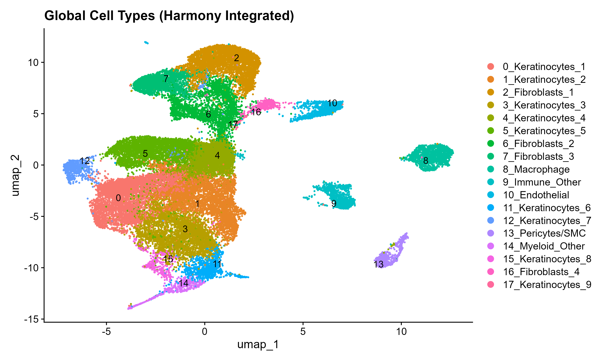
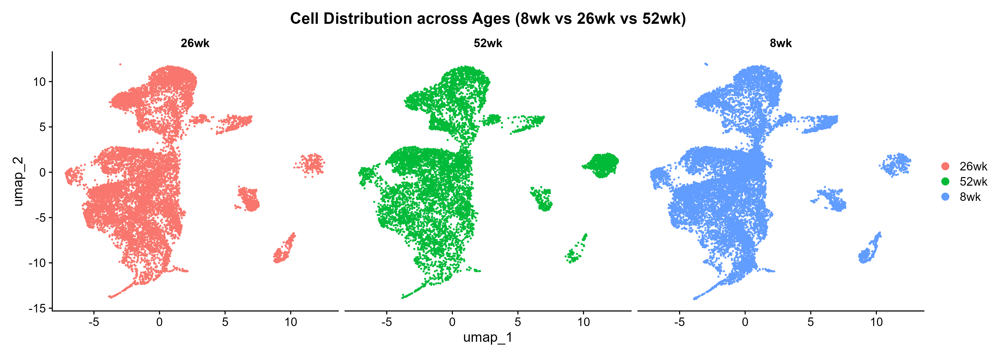
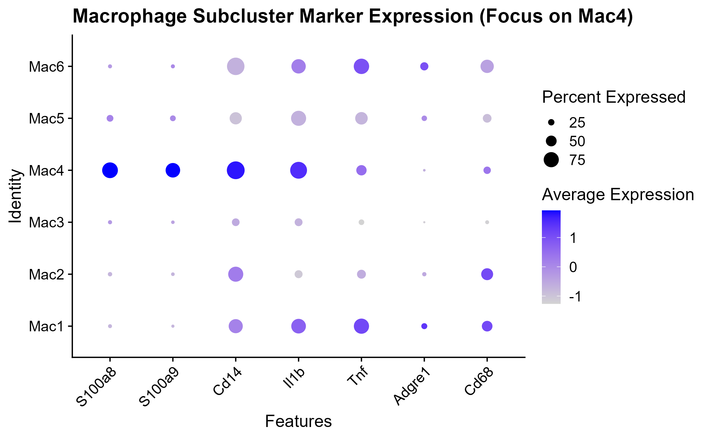
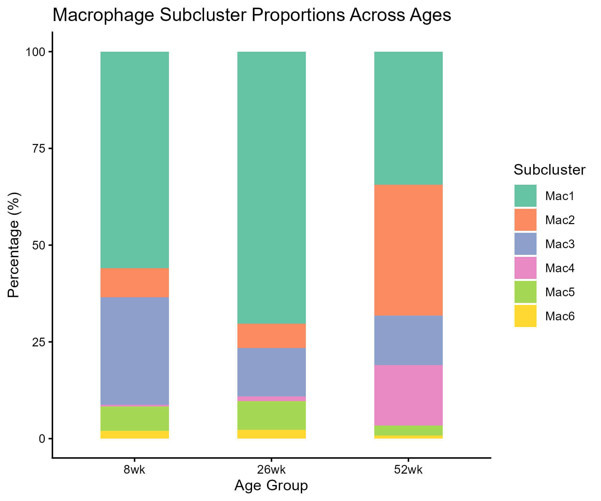
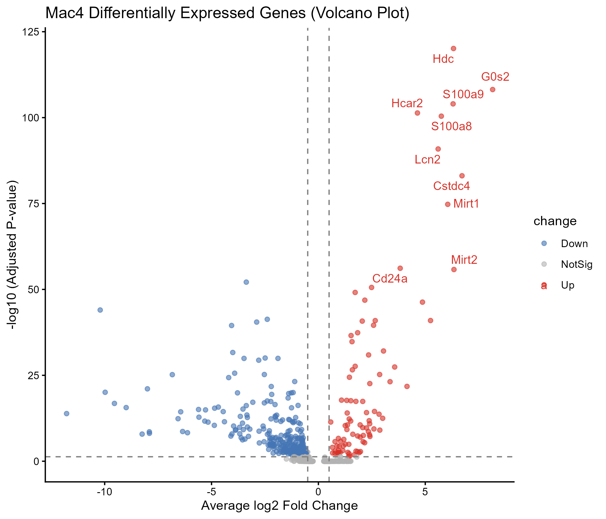
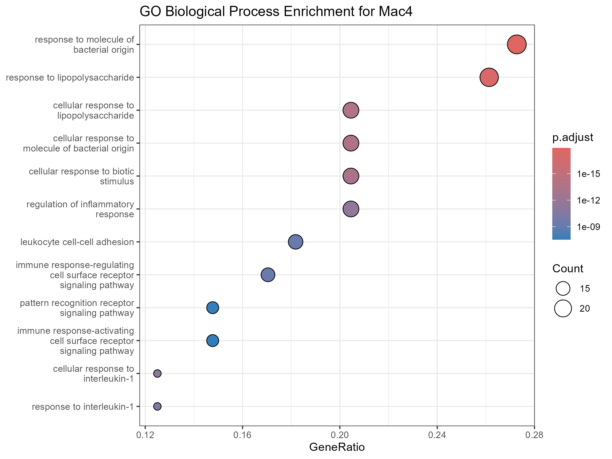

# 🧬 小鼠皮肤衰老单细胞转录组分析（GSE336400 数据集复现）


本项目基于小鼠皮肤衰老单细胞转录组数据集（**GSE336400**），构建了一套端到端的生物信息学分析流程。

研究通过对比不同年龄段（**8周-青年、26周-中年、52周-老年**）的小鼠皮肤细胞图谱，成功鉴定并深入解析了一群在衰老皮肤中显著富集的**促炎/促衰老巨噬细胞亚群（Mac4）**。

---


## 📌 核心生物学发现 (Biological Insights)

* **绘制皮肤衰老全局细胞图谱**：系统解析了小鼠皮肤在不同年龄段（8周/26周/52周）的细胞组成变化，精确鉴定出成纤维细胞、角质形成细胞、内皮细胞及巨噬细胞等主要细胞类群。
* **发现衰老特异性巨噬细胞亚群 (Mac4)**：在巨噬细胞群体（Mac1–Mac6）中锁定了一个关键的促炎亚群 **Mac4**，该亚群在 **52周（老年组）小鼠皮肤中呈现爆发式增长**，是衰老微环境重构的核心标志。
* **明确 Mac4 的分子签名 (Molecular Signature)**：鉴定出 Mac4 亚群特异性高表达经典促炎与生物标志物基因（*S100a8*, *S100a9*, *Cd14* 及 *Il1b*）。
* **揭示驱动皮肤免疫衰老的分子机制**：GO 功能富集表明，Mac4 亚群高度激活了 **LPS 样类致炎反应、白细胞募集以及 IL-1 信号通路**，通过持续释放促炎因子招募免疫细胞，驱动皮肤微环境的慢性炎症与免疫衰老（Immunosenescence）。

---


## 📂 项目目录结构

```text
.
├── BioPratice10_scRNA.Rproj                # RStudio 项目工程文件
├── README.md                               # 项目英文说明文档
├── README_CN.md                            # 项目中文说明文档
├── data/                                   # 原始 10x scRNA-seq 数据存放目录
├── processed_data/                         # 中间处理数据与分析结果 (.rds, .csv)
├── plots/                                  # 分析过程中生成的高分辨率结果图件
│   ├── 01_QC_vlnplot_before_filtering.png
│   ├── 01_QC_vlnplot_after_filtering.png
│   ├── 02_UMAP_global_clusters.png
│   ├── 02_UMAP_annotated.png
│   ├── 02_UMAP_split_by_age.png
│   ├── 02_Marker_genes_dotplot.png
│   ├── 03_Macrophage_UMAP_subclusters.png
│   ├── 03_Mac4_Marker_Bubble.png
│   ├── 03_Mac4_Proportion_by_Age.png
│   ├── 04_Mac4_DEG_Volcano.png
│   └── 04_Mac4_GO_Enrichment.png
└── scripts/                                # 核心分析 R 脚本目录
    ├── 01_qc_and_filtering.R               # 01: 数据质控与细胞过滤
    ├── 02_integration_and_clustering.R     # 02: Harmony 整合与全局注释
    ├── 03_macrophage_subclustering.R       # 03: 巨噬细胞细分与 Mac4 锁定
    └── 04_deg_and_go_enrichment.R          # 04: Mac4 差异基因与 GO 富集分析
```


# 结果展示


### 1. 全局细胞图谱与样本整合

使用 Harmony 对 8wk、26wk 和 52wk 的小鼠皮肤细胞进行降维整合，消除了批次效应并完成主要细胞类型注释。

<table>
  <tr>
    <td align="center"><b>全局细胞类型注释 UMAP</b></td>
    <td align="center"><b>按年龄拆分对比 UMAP</b></td>
  </tr>
  <tr>
    <td align="center"></td>
    <td align="center"></td>
  </tr>
</table>

### 2. 巨噬细胞亚群细分与 Mac4 锁定

对巨噬细胞单独提取重聚类，发现高表达 *S100a8+/S100a9+* 的 **Mac4** 亚群在 52 周老年组中比例显著飙升。

<table>
  <tr>
    <td align="center"><b>Mac4 标志基因表达气泡图</b></td>
    <td align="center"><b>各年龄段巨噬细胞亚群比例变化</b></td>
  </tr>
  <tr>
    <td align="center"></td>
    <td align="center"></td>
  </tr>
</table>

### 3. 分子机制与 GO 富集分析

Mac4 的差异基因火山图与 GO 气泡图证实，该亚群在老年皮肤中主要发挥促炎、细胞招募与 IL-1 信号传导功能。

<table>
  <tr>
    <td align="center"><b>Mac4 差异基因火山图</b></td>
    <td align="center"><b>GO 生物学过程富集气泡图</b></td>
  </tr>
  <tr>
    <td align="center"></td>
    <td align="center"></td>
  </tr>
</table>


## 🚀 快速开始与使用指南

###  数据准备 (Data Preparation)

本项目使用的原始单细胞转录组数据来源于 NCBI GEO 数据库：

1. **原始数据下载**：访问 GEO 数据集 [GSE336400](https://www.ncbi.nlm.nih.gov/geo/query/acc.cgi?acc=GSE336400) 并下载补充文件（Supplementary files）。
2. **存放路径配置**：下载完成后，请将 10x Genomics 的输出文件（`matrix.mtx.gz`, `features.tsv.gz`, `barcodes.tsv.gz`）按样本存放于 `data/` 目录下：
   ```text
   data/
   ├── GSM9834280_8wk_ctrl/
   │   ├── matrix.mtx.gz
   │   ├── features.tsv.gz
   │   └── barcodes.tsv.gz
   ├── GSM9834281_8wk_Apo/
   │   └── ...
   └── GSM9834282_26wk_ctrl/
       └── ...

### 环境配置

请确保安装了 R (>= 4.2) 及以下核心依赖包：

```
install.packages(c("tidyverse", "ggrepel"))
BiocManager::install(c("Seurat", "harmony", "clusterProfiler", "org.Mm.eg.db"))
```


### 运行步骤

按顺序执行 `scripts/` 目录下的 R 脚本：

```
# 步骤 1：数据加载、质控与过滤
Rscript scripts/01_qc_and_filtering.R

# 步骤 2：全局数据整合、降维聚类与注释
Rscript scripts/02_integration_and_clustering.R

# 步骤 3：巨噬细胞亚群提取与 Mac4 锁定
Rscript scripts/03_macrophage_subclustering.R

# 步骤 4：Mac4 差异表达基因与 GO 富集分析
Rscript scripts/04_deg_and_go_enrichment.R
```


## 🛠️ 调试与技术避坑记录 

### 1. Seurat V5 多图层未缝合报错 (`JoinLayers`)
* **问题描述**：在脚本 04 运行 `FindMarkers()` 计算 Mac4 亚群差异基因时，触发报错：
  `Error in FindMarkers.StdAssay: data layers are not joined. Please run JoinLayers`
* **原因分析**：Seurat V5 引入了新的 `Layer` 机制。经过样本整合与子集提取 (`subset`) 后，表达矩阵被拆分存在于多个独立图层中，导致差异表达分析函数无法直接读取。
* **解决方案**：在调用 `FindMarkers()` 前，显式运行 `seu_mac <- JoinLayers(seu_mac)` 缝合所有数据图层。

### 2. DimPlot 图中央数字与右侧图例名称的解耦定制
* **问题描述**：希望实现“UMAP 图中央保持干净纯数字编号，右侧图例显示 `数字_细胞类型`”。若直接使用 `RenameIdents()`，图中央的 Label 会被强制替换为长英文名字，造成图面文字重叠挤压。
* **原因分析**：`DimPlot()` 的 `label = TRUE` 默认读取对象的 Active Idents，修改 Idents 会导致图面与图例同步改变。
* **解决方案**：将 Active Idents 保持为纯数字的 `seurat_clusters`，使用 `scale_color_discrete(labels = ...)` 仅修改右侧图例；同时在将注释写入 `meta.data` 时配合 `unname()` 消除向量名称冲突（避免触发 `No cell overlap between new meta data and Seurat object` 报错）。


